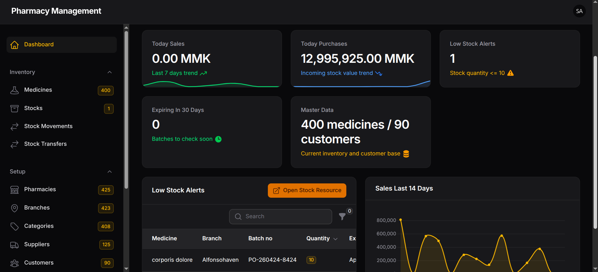
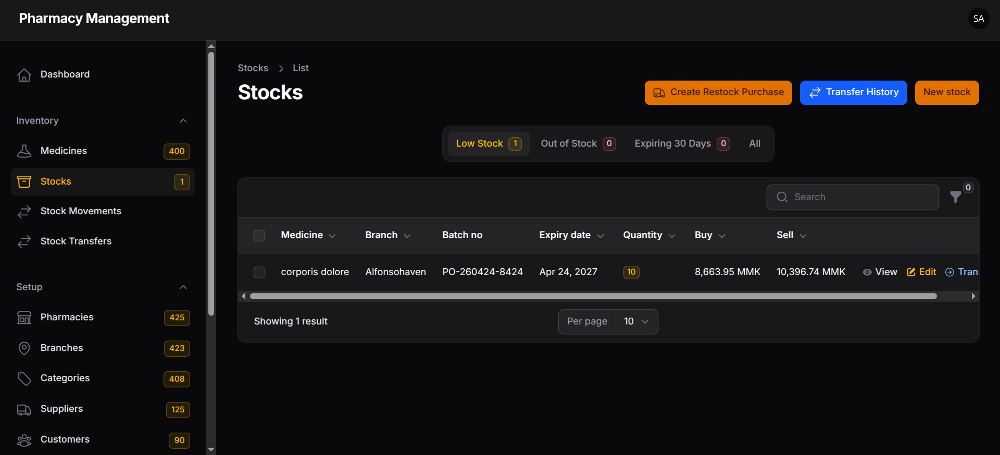
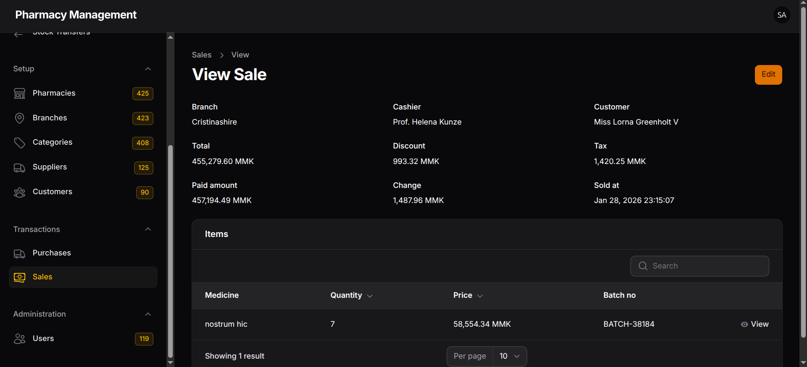
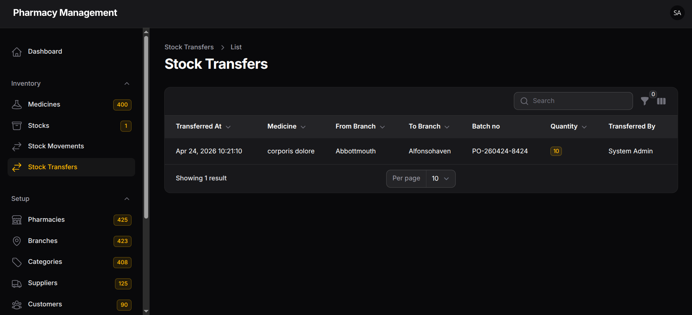

# Pharmacy Management System

Admin-focused, multi-branch pharmacy management platform built with Laravel + Filament.

Current scope is Admin panel and inventory workflows.  
Planned next scope includes dedicated `cashier` and `Pharmacist` workflows.

## Feature List (Current Scope)

- Multi-branch inventory management
- Medicine, category, supplier, customer, branch master data modules
- Purchase flow with item-level stock-in automation
- Sale flow with item-level stock-out automation
- Stock Auto Fill for sale/purchase item entry (batch and price suggestion)
- Stock Alert Flow (Low Stock, Out of Stock, Expiring Soon)
- Inventory Management Flow with transactional stock updates
- Branch-to-branch stock transfer flow
- Stock movement audit trail (`in`, `out`, `adjustment`)
- Restock flow from low-stock records
- Dashboard widgets for sales, purchases, stock alerts, and trends

## Tech Stack

- PHP 8.3
- Laravel 13
- Filament 5
- Livewire 4
- MySQL
- Eloquent ORM
- Pest 4
- Laravel Pint
- Vite

## Preview

Add your screenshots to any folder you prefer (example: `docs/previews/`) and update the image paths below.






## Planned Next Features

- Cashier workflow (POS-focused quick sale flow)
- Pharmacist workflow (dispense and verification flow)
- Role-based operational dashboards

## Quick Start

```bash
composer install
cp .env.example .env
php artisan key:generate
php artisan migrate
php artisan db:seed
php artisan serve
```

For frontend assets:

```bash
npm install
npm run dev
```

## License

This project is open-sourced under the MIT license.
